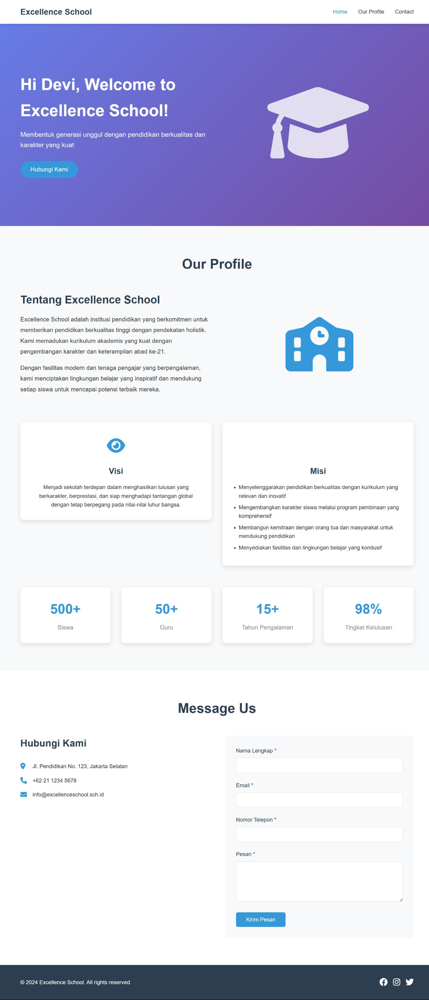

# Website Portfolio Sekolah - Excellence School

Proyek website portfolio sekolah yang dibuat sebagai bagian dari mini project dalam kursus Software Engineering. Website ini menampilkan profil sekolah dengan desain responsif dan fitur interaktif menggunakan HTML, CSS, dan JavaScript.

## 📋 Deskripsi Proyek

Website ini adalah platform digital untuk menampilkan profil sekolah Excellence School dengan fitur-fitur modern dan user-friendly. Website mencakup halaman utama dengan sambutan personal, informasi lengkap tentang sekolah, dan form kontak dengan validasi JavaScript.

## ✨ Fitur Utama

### 🏠 Halaman Home
- **Banner Hero** dengan background gradient yang menarik
- **Sambutan Personal** - "Hi [Nama], Welcome to Excellence School!" menggunakan JavaScript prompt
- **Call-to-Action Button** untuk navigasi ke form kontak
- **Desain Visual** dengan ikon Font Awesome yang modern

### 🏫 Halaman Our Profile
- **Tentang Sekolah** - Informasi lengkap tentang Excellence School
- **Visi & Misi** - Ditampilkan dalam card design yang menarik
- **Statistik Sekolah** - Data jumlah siswa, guru, pengalaman, dan tingkat kelulusan
- **Layout Grid** yang responsif untuk berbagai ukuran layar

### 📧 Form "Message Us"
- **Validasi JavaScript** untuk semua field input:
  - Nama (minimal 2 karakter)
  - Email (format email valid)
  - Nomor Telepon (minimal 10 digit, hanya angka dan karakter khusus)
  - Pesan (minimal 10 karakter)
- **Real-time Validation** saat user meninggalkan field
- **Display Data** yang dikirim setelah form berhasil disubmit
- **Error Messages** yang informatif dan user-friendly

### 📱 Responsive Design
- **Desktop First** approach dengan breakpoint untuk tablet dan mobile
- **Mobile Navigation** dengan hamburger menu
- **Flexible Grid Layout** yang menyesuaikan berbagai ukuran layar
- **Touch-friendly** interface untuk perangkat mobile

## 🛠️ Teknologi yang Digunakan

- **HTML5** - Struktur markup semantik
- **CSS3** - Styling dengan Flexbox dan CSS Grid
- **JavaScript** - Interaktivitas dan validasi form
- **Font Awesome** - Icons library
- **Responsive Design** - Mobile-first approach

## 📁 Struktur File

```
project-root/
│
├── index.html          # File utama website
├── css/
│   └── style.css      # File styling (embedded dalam HTML)
├── js/
│   └── script.js      # File JavaScript (embedded dalam HTML)
└── README.md          # Dokumentasi proyek
```

## 🚀 Cara Menjalankan Proyek

### Persyaratan Sistem
- Web browser modern (Chrome, Firefox, Safari, Edge)
- Koneksi internet untuk memuat Font Awesome icons
- Text editor (Visual Studio Code recommended)
- Git untuk version control

### Langkah Instalasi

1. **Clone Repository**
   ```bash
   git clone [URL_REPOSITORY]
   cd [REPOSITORY_NAME]
   ```

2. **Buka File**
   - Buka `index.html` di web browser
   - Atau gunakan Live Server extension di VS Code

3. **Development**
   ```bash
   # Jika menggunakan Live Server di VS Code
   # Klik kanan pada index.html > Open with Live Server
   ```

## 🎯 Fitur JavaScript yang Diimplementasi

### 1. Sambutan Personal
```javascript
// Meminta nama user dan menampilkan sambutan personal
setTimeout(function() {
    const userName = prompt('Siapa nama Anda?');
    if (userName && userName.trim() !== '') {
        document.getElementById('userName').textContent = userName;
    }
}, 1000);
```

### 2. Validasi Form Lengkap
```javascript
function validateForm() {
    // Validasi nama, email, telepon, dan pesan
    // Menampilkan error messages yang spesifik
    // Return true/false berdasarkan validasi
}
```

### 3. Real-time Validation
```javascript
// Validasi saat user meninggalkan field input
document.getElementById('name').addEventListener('blur', function() {
    // Validasi nama secara real-time
});
```

### 4. Display Form Data
```javascript
function displaySubmittedData(data) {
    // Menampilkan data yang telah disubmit
    // Format data dalam HTML yang readable
}
```

### 5. Smooth Scrolling Navigation
```javascript
// Smooth scrolling untuk navigasi antar section
document.querySelectorAll('a[href^="#"]').forEach(anchor => {
    anchor.addEventListener('click', function (e) {
        e.preventDefault();
        // Smooth scroll implementation
    });
});
```

### 6. Mobile Menu Toggle
```javascript
// Toggle hamburger menu untuk mobile
hamburger.addEventListener('click', function() {
    navMenu.classList.toggle('active');
});
```

## 🎨 Desain dan UI/UX

### Color Palette
- **Primary Blue**: #3498db
- **Dark Blue**: #2980b9
- **Purple Gradient**: #667eea → #764ba2
- **Dark Gray**: #2c3e50
- **Light Gray**: #f8f9fa
- **Success Green**: #27ae60
- **Error Red**: #e74c3c

### Typography
- **Font Family**: Arial, sans-serif
- **Heading Sizes**: 1.5rem - 3rem
- **Body Text**: 1rem - 1.2rem
- **Line Height**: 1.6 - 1.8

### Layout Principles
- **Grid System**: CSS Grid dan Flexbox
- **Spacing**: Consistent margin dan padding
- **Card Design**: Shadow dan rounded corners
- **Visual Hierarchy**: Typography scale dan color contrast

## 📱 Responsive Breakpoints

```css
/* Desktop First Approach */
@media (max-width: 768px) {
    /* Tablet styles */
}

@media (max-width: 480px) {
    /* Mobile styles */
}
```

### Responsive Features
- **Navigation**: Hamburger menu untuk mobile
- **Grid Layout**: 2 kolom → 1 kolom pada mobile
- **Typography**: Font size adjustment
- **Spacing**: Reduced padding dan margin
- **Touch Targets**: Minimal 44px untuk tap targets

## ✅ Validasi Form Detail

### Validasi Nama
- ✅ Tidak boleh kosong
- ✅ Minimal 2 karakter
- ✅ Real-time validation

### Validasi Email
- ✅ Tidak boleh kosong
- ✅ Format email valid (regex: `/^[^\s@]+@[^\s@]+\.[^\s@]+$/`)
- ✅ Real-time validation

### Validasi Nomor Telepon
- ✅ Tidak boleh kosong
- ✅ Minimal 10 digit
- ✅ Hanya angka dan karakter khusus (+, -, space, parentheses)
- ✅ Real-time validation

### Validasi Pesan
- ✅ Tidak boleh kosong
- ✅ Minimal 10 karakter
- ✅ Real-time validation

## 🧪 Testing Checklist

### Functionality Testing
- [ ] Form validation bekerja dengan benar
- [ ] Sambutan personal muncul setelah input nama
- [ ] Navigation links berfungsi (smooth scrolling)
- [ ] Mobile menu toggle bekerja
- [ ] Form submission menampilkan data yang benar
- [ ] Error messages muncul sesuai kondisi

### Responsive Testing
- [ ] Layout responsive di berbagai ukuran layar
- [ ] Mobile navigation bekerja dengan baik
- [ ] Font size dan spacing sesuai di mobile
- [ ] Touch targets mudah diakses
- [ ] Images dan icons tidak overflow

### Browser Compatibility
- [ ] Chrome (latest)
- [ ] Firefox (latest)
- [ ] Safari (latest)
- [ ] Edge (latest)

## 🔧 Kustomisasi

### Mengubah Informasi Sekolah
1. Edit bagian "Tentang Excellence School" di section profile
2. Update Visi & Misi sesuai kebutuhan
3. Modifikasi statistik sekolah (jumlah siswa, guru, dll)
4. Ganti informasi kontak di bagian footer

### Mengubah Warna Tema
1. Update CSS custom properties untuk color palette
2. Modifikasi gradient background di hero section
3. Sesuaikan warna accent untuk consistency

### Menambah Fitur Baru
1. Tambahkan section baru di HTML
2. Buat styling di CSS
3. Implementasi JavaScript jika diperlukan
4. Update navigation menu

## 📖 Pembelajaran dari Proyek

### Skills yang Dikembangkan
1. **HTML Semantik** - Penggunaan tag yang meaningful
2. **CSS Advanced** - Grid, Flexbox, dan Responsive Design
3. **JavaScript DOM Manipulation** - Event handling dan validation
4. **Form Validation** - Client-side validation yang robust
5. **Responsive Web Design** - Mobile-first approach
6. **User Experience** - Smooth interactions dan feedback

### Best Practices yang Diterapkan
1. **Semantic HTML** untuk accessibility
2. **Progressive Enhancement** untuk compatibility
3. **Mobile-First Design** untuk better UX
4. **Clean Code** dengan proper commenting
5. **Performance Optimization** dengan efficient CSS dan JS

## 📸 Screenshot


## 🚀 Deployment

### GitHub Pages
1. Push code ke GitHub repository
2. Go to Repository Settings
3. Scroll ke GitHub Pages section
4. Select source branch (main/master)
5. Website akan tersedia di: `https://username.github.io/repository-name`

### Local Development Server
```bash
# Menggunakan Python
python -m http.server 8000

# Menggunakan Node.js (http-server)
npx http-server

# Menggunakan PHP
php -S localhost:8000
```

## 📞 Kontak dan Support

Jika ada pertanyaan atau membutuhkan bantuan dengan proyek ini:

- **Email**: info@excellenceschool.sch.id
- **GitHub Issues**: Buat issue di repository ini
- **Documentation**: Rujuk ke README.md ini

## 📄 Lisensi

Proyek ini dibuat untuk tujuan pembelajaran dalam kursus Software Engineering. Silakan gunakan dan modifikasi sesuai kebutuhan pembelajaran Anda.

---

**Dibuat dengan ❤️ untuk Excellence School**

*Last updated: Juni 2025*
